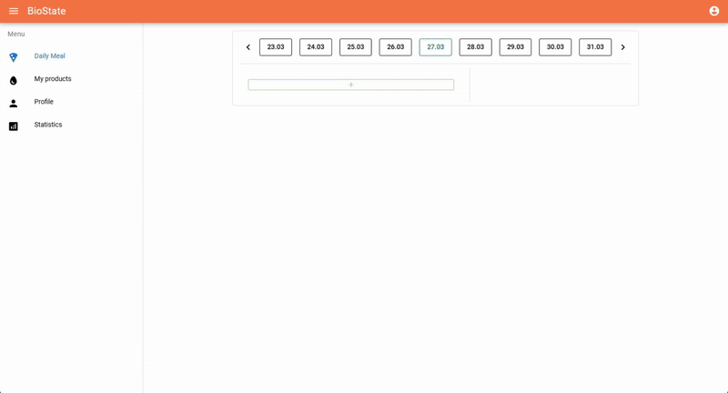

# BioState Frontend

This repository contains the frontend application for BioState, built using Vue 3 and the Quasar framework. BioState is a comprehensive application designed to help you monitor and manage various aspects of your well-being. This frontend provides the user interface for interacting with the backend API to record dietary intake, track macronutrients, view statistics, and set limits.

## Installation

> **Note:** For now frontend application is designed to be run using Docker Compose, alongside the **[BioState backend](https://github.com/lewenbraun/biostate-backend)**.

But you can install and deploy the frontend part separately:

1.  **Clone the Repository**

    Navigate to the parent directory where you cloned the backend repository and clone the frontend repository:

    ```bash
    git clone https://github.com/lewenbraun/biostate-frontend.git
    ```

4.  **Configure Environment**

    Copy the sample environment file:

    ```bash
    cp .env.example .env
    ```

    Update your `.env` file if necessary.

2.  **Install the dependencies**

    ```bash
    yarn
    # or
    npm install
    ```

3.  **Start the app in development mode**

    ```bash
    quasar dev
    ```

4. **Build the app for production (if needed)**

    ```bash
    quasar build
    ```

## Usage

Here's a quick glimpse of how the application works:



## Contributing

Contributions, issues, and feature requests are welcome. Please check the issues page for more details.

## License

This project is licensed under the MIT License.
